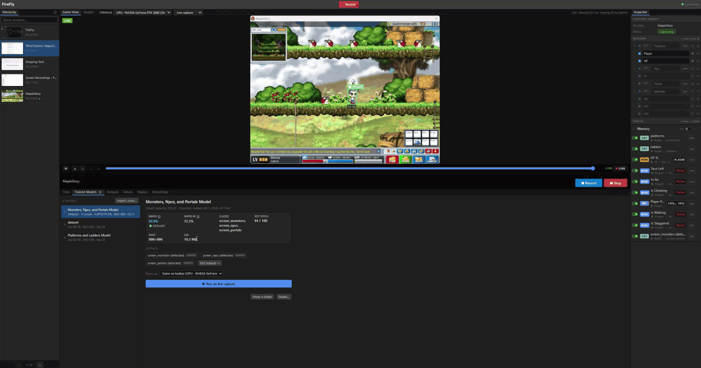
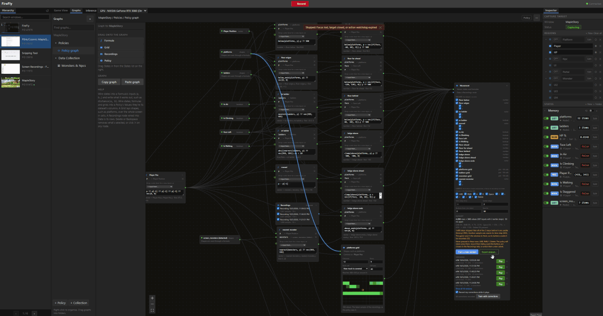

# FireFly

**Teach an agent to play a game by playing it yourself.**

FireFly is a Windows desktop tool that turns a game window into structured observations, records them alongside the buttons you press, and trains small neural networks based on behavior cloning that can learn how to play the game like you. It works with any game: everything game-specific lives in your own data (model outputs, regions, Lua scripts and graphs), not in FireFly's code.

> **Status:** under active development. Windows only. Expect rough edges.

<p align="center">
  
</p>
<p align="center"><em>Running two models at once from the Trained Models tab: a YOLO detector boxing the monsters, and a segmentation model whose outputs trace the platforms (green) and ladders (yellow). The States on the right update live.</em></p>

<p align="center">
  
</p>
<p align="center"><em>A policy trained in the Policy Graph playing the game by itself. The banner shows what it's pressing and how fresh the frames it acts on are, and it stops the moment you press a key or click in the game.</em></p>

---

## What it does

**See the game**
- **Capture any window** with Windows Graphics Capture at up to 60 fps, with a 60-second rewind buffer you can scrub through.
- **Run trained models** on every frame, on the CPU or a DirectML GPU, several at once:
  - **Segmentation** (UNet): a mask of, for example, platforms and ladders.
  - **Object detection** (YOLO): boxes per class, for example monsters, NPCs and portals.
- **Shape the outputs** with editable flows of generic steps (clean up, trace lines, keep runs, filter, count, and more), so turning a mask into "platforms" and "ladders" is data you edit, not code.
- **Read regions of the screen:** a bar's fill, a colour, or text and numbers through Windows' built-in OCR.
- **Follow objects** with template matching: masks, grayscale or edge matching, every instance at once, and boxes that resize with the object. You also get position and velocity.
- **Read  memory and run Lua:** States read memory addresses or run sandboxed Lua scripts (no file or network access) that can read memory, regions and other States.

**Record and learn**
- **Record** chosen observations with your button presses at a fixed rate. You choose the buttons on a full on-screen keyboard.
- **Build datasets in a node editor** (the Policy Graph): drag in States, write formulas over them, lay grids around the player, and pick the recordings and labels.
- **Train and play policies:** a small behaviour-cloning network learns from your recordings. Play it back with safety guards, and record corrections whenever you take over (DAgger-style), then train again on them.
- **Collect training data automatically** with collection graphs: save screenshots and labels (for example, YOLO datasets) when something new appears.
- **Train models in the app:** UNet segmentation and YOLO detection, with progress, metrics and export to ONNX.

## How it fits together

```
React UI (src/)  ──►  Electron main (electron/)  ──►  native runtime (native/, C++)
                                                 └─►  Python workers (worker/)
```

- **Native runtime:** capture, the observation graph (models, geometry, OCR, Lua), template matching, recording to SQLite, and the input guard. Capture, graph evaluation and template matching run on separate workers, so a slow model doesn't hold up the others.
- **Python workers:** dataset building, policy training and prediction, and the UNet and YOLO trainers.

## Requirements

- Windows 10 or 11.
- [Node.js](https://nodejs.org/) (current LTS).
- Python 3.12, as `py -3.12`.
- Visual Studio 2022 (or its Build Tools) with the C++ workload, CMake 3.24 or newer, and git.
- **Optional:**
  - A DirectX 12 GPU, to run models on the GPU (DirectML).
  - An NVIDIA GPU with a CUDA build of PyTorch, for faster training. The setup script installs the CPU build.
  - An OCR language installed in Windows (Settings › Time & language › Language & region), to read text from the screen.

## Download

Get the Windows installer, `FireFly-Setup-<version>.exe`, from the [latest release](https://github.com/AndrewAhn1000/FireFly/releases/latest), and run it. It includes everything FireFly needs: the native runtime, ONNX Runtime with DirectML, and a bundled Python with PyTorch for training.

- **Windows SmartScreen may warn you** the first time, because the installer isn't code-signed. Choose **More info › Run anyway**.
- **Training runs on the CPU** in the installed app, since it bundles the CPU build of PyTorch. Models still run on the GPU through DirectML. For GPU training, build from source with a CUDA build of PyTorch.

## Building from source

Install the JavaScript dependencies, then set up and build the native runtime:

```powershell
npm install
npm run native:setup       # pins vcpkg and its packages into .tools/
npm run native:onnxruntime # ONNX Runtime (CPU); or native:onnxruntime:gpu for DirectML
npm run native:configure   # the TEMP folder's path must not contain spaces
npm run native:build
```

Set up Python (a `.venv` with PyTorch, ONNX and Ultralytics):

```powershell
npm run python:setup
```

Run the app:

```powershell
npm run build
npm start
```

To develop with hot reload instead, start Vite in one terminal and Electron in another:

```powershell
npm run dev
```

```powershell
$env:NODE_ENV='development'; npx electron .
```

## A first session

1. **Pick a window** under **Hierarchy** and press **Start Session**.
2. **Describe the game.** In the **Inspector**:
   - Draw **Regions** on the Game View: boxes to read values from, or to follow objects in.
   - Add **States**: the values you care about, such as the player's position, HP, or a list of monsters. A State can read a region, a model output, a memory address or a Lua script. Folders keep them organised, and any State can be switched off.
3. **Run models** (optional). Train or import one in the **Train** and **Trained Models** tabs, press **Run**, and decide what it outputs in the **Outputs** tab.
4. **Record.** In the **Recordings** tab, choose the buttons on the keyboard and what to record, press **Start recording**, then click into the game and play.
5. **Train a policy.** In **Graphs**, drag your States into a Policy Graph, add formulas and a Recordings node, then press **Train** on the Policy node.
6. **Play it.** In the **Play** tab, pick a version and press **Play**, or **Play and record my corrections**: take over whenever it goes wrong, and once you've corrected it, **Train a new version with my corrections**.

## Project layout

| Path | What's there |
|---|---|
| `src/` | The React UI: Window View, Inspector, Policy Graph, panels |
| `electron/` | The main process: windows, the model library, training, play loop |
| `native/` | The C++ runtime: capture, observation graph, models, template matching, recording, input guard |
| `worker/` | Python: datasets, formulas, policy training and prediction, UNet and YOLO training |
| `scripts/` | Setup scripts, and example Lua scripts |
| `tests/` | UI, runtime and unit tests |
| `docs/` | Guides: live inference, data collection, Lua regions |

## Tests

```powershell
npm run build          # strict TypeScript check and production build
npm run native:test    # native graph, template, recording and worker tests
npm run test:python    # Python workers
npm run test:play      # the play loop, with stand-ins
```

The UI tests run the real app in an isolated profile, for example `npm run test:keyboard-ui`. See `package.json` for the full list. A few of them (`test:detector-ui`, `test:multi-model-ui`, `test:runtime-preview`) need trained models in `runs/` or a dataset in `dataset/`, which are kept out of the repository.

## Documentation

- [`docs/live-inference.md`](docs/live-inference.md): inference devices, the runtime's workers, and GPU support.
- [`docs/data-collection.md`](docs/data-collection.md): the graph directory and collection graphs.
- [`docs/lua-regions.md`](docs/lua-regions.md): Lua regions, their coordinates and editing.
- [`CLAUDE.md`](CLAUDE.md): detailed architecture and design notes.

## License

FireFly is free software: you can redistribute it and/or modify it under the terms of the **GNU Affero General Public License**, version 3 or (at your option) any later version. See [`LICENSE`](LICENSE).

Copyright (C) 2026 the FireFly contributors.

Third-party components keep their own licenses. Among them, Ultralytics, which trains the YOLO detectors, is also AGPL-3.0, and the models it exports say so in their metadata.
